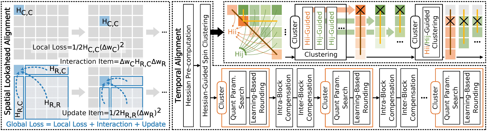

# STLA: Spatiotemporal Lookahead Alignment for Post-Training Quantization

This repository contains the official PyTorch implementation for the ICML 2026 paper *"STLA: Spatiotemporal Lookahead Alignment for Post-Training Quantization"*.



## Get Started

Clone this repository:

```bash
git clone https://anonymous.4open.science/r/STLA
```

Then navigate to the project directory:

```bash
cd STLA
```

Install the required dependencies:

```bash
pip install torch==1.10.0 torchvision --index-url https://download.pytorch.org/whl/cu113
pip install transformers==4.43.2
pip install datasets==2.20.0
```

## Usage

The code in this repository was modified based on [aespa](https://github.com/SamsungLabs/aespa).

To quantize and evaluate an LLM, use the following command:

```bash
python main.py --model_path facebook/opt-125m --calib_data c4 --nsamples 128 --seqlen 2048 --seed 0 --w_bits 3 --blocksize 256 --groupsize 256 --clustersize 256 --loss_option global --order_option spin --comp_method GPTAQ --learn_rounding --num_iters 200 --lr 1.1 --round_weight 1.0 --block_v
```

### Command-Line Arguments

- `--model_path`: Path to the LLM model. Examples: `facebook/opt-125m`, `facebook/opt-1.3b`, `facebook/opt-6.7b`, `meta-llama/Llama-2-7b`, `meta-llama/Llama-3.1-8B`.
- `--save_model`: Save the fake-quantized model.
- `--cache_dir`: Cache directory for calibration data.
- `--calib_data`: Calibration dataset. Choices: `c4`, `wikitext2`.
- `--nsamples`: Number of calibration samples.
- `--seqlen`: Maximum sequence length.
- `--seed`: Random seed.
- `--w_bits`: Weight bit-width.
- `--w_sym`: Enable symmetric weight quantization.
- `--groupsize`: Group size for groupwise quantization. `-1` means per-channel quantization.
- `--block_v`: Apply block-wise objective for the value projection in attention layers to optimize reconstruction loss at the block level.
- `--loss_option`: Loss scope. Choices: `local`, `global`.
- `--order_option`: Hessian-based re-ordering. Choices: `spin`, `act`, `none`.
- `--comp_method`: Compensation method. Choices: `GPTAQ`, `GPTQ`.
- `--learn_rounding`: Learn the rounding policy via gradient descent.
- `--blocksize`: OPTQ block size.
- `--clustersize`: Number of columns per cluster.
- `--lr`: Learning rate for Adaround training.
- `--round_weight`: Weight of rounding loss in Adaround.
- `--round_weight_qkv`: Rounding loss weight for QKV.
- `--num_iters`: Number of Adaround iterations.
- `--replace`: Value used for Hessian diagonal replacement.
- `--percdamp`: Percent of the average Hessian diagonal used for dampening.

For more details on the implementation-specific options, please refer to [utils.py](utils.py).

## Outputs

Quantization results are written to the `results/` directory. If `--save_model` is enabled, the quantized model is saved under `qmodels/`. A summary CSV named `quantization_results.csv` is also appended in the project root.

### Ablation Results

The table below reports the contribution of the lookahead global objective, coupled spatiotemporal alignment optimization, and the SpinCluster strategy on perplexity and GPU runtime.

| Gran. | Group Size | Coupled | Cluster | Loss | OPT-125M C4 | OPT-125M Wkt-2 | OPT-125M Time | Llama2-7B C4 | Llama2-7B Wkt-2 | Llama2-7B Time |
| --- | --- | --- | --- | --- | ---: | ---: | ---: | ---: | ---: | ---: |
| Channel | - | × | × | Global | 31.21 | 34.52 | 109.3 s | 8.42 | 6.51 | 2.3 hr |
| Channel | - | ✓ | × | Local | 32.63 | 35.82 | 74.7 s | 8.47 | 6.49 | 36.4 min |
| Channel | - | ✓ | × | Global | 30.69 | 33.45 | 76.5 s | 8.30 | 6.36 | 38.6 min |
| Group | 256 | × | × | Global | 30.33 | 33.59 | 116.4 s | 8.09 | 6.19 | 2.3 hr |
| Group | 256 | ✓ | × | Local | 31.30 | 35.86 | 75.2 s | 8.14 | 6.11 | 32.8 min |
| Group | 256 | ✓ | × | Global | 29.86 | 32.00 | 76.8 s | 8.02 | 6.44 | 32.8 min |
| Group | 256 | ✓ | Spin | Local | 30.51 | 33.39 | 89.4 s | 8.10 | 6.17 | 39.7 min |
| Group | 256 | ✓ | Spin | Global | 29.26 | 31.01 | 89.8 s | 7.99 | 6.09 | 40.6 min |

## Citation

If you find this work useful for your research, please cite our paper:

```bash
@inproceedings{zhang2026stla,
title={{STLA}: Spatiotemporal Lookahead Alignment for Post-Training Quantization},
author={Zhang, Zuqi and Sun, Chenghe and Chu, Xiangyi and Yu, Wei-Han and Un, Ka-Fai and Martins, Rui P. and Mak, Pui-In and Xu, Jiawei},
booktitle={Forty-third International Conference on Machine Learning},
year={2026},
url={https://openreview.net/forum?id=d3RFDLBw01}
}
```
